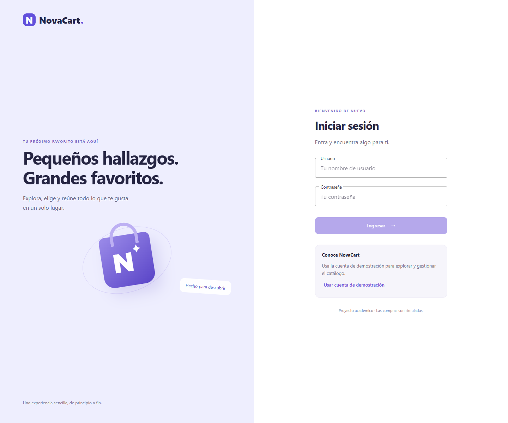
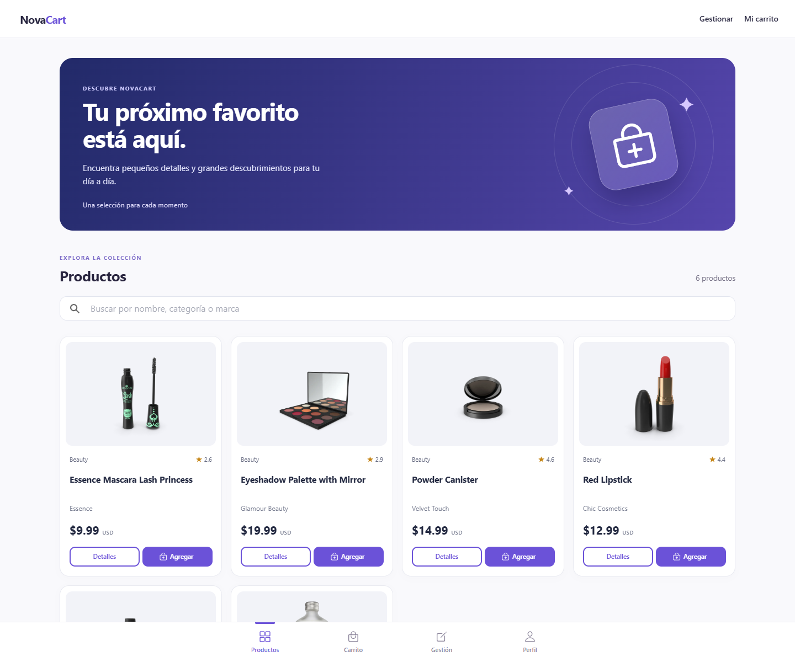
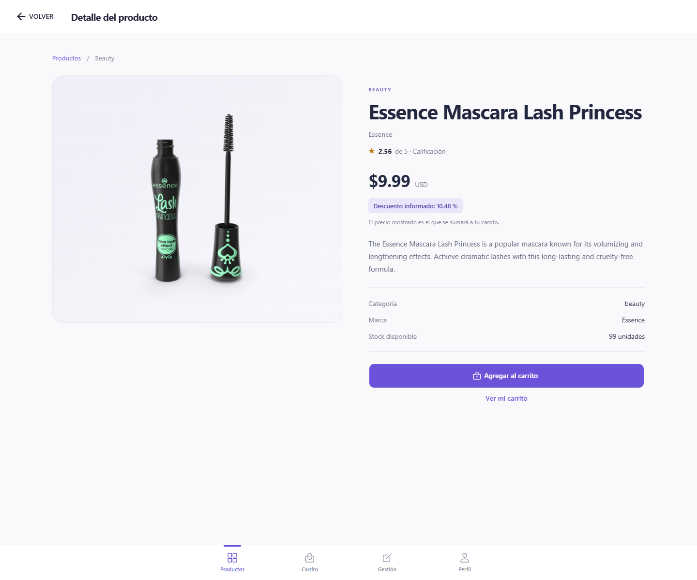
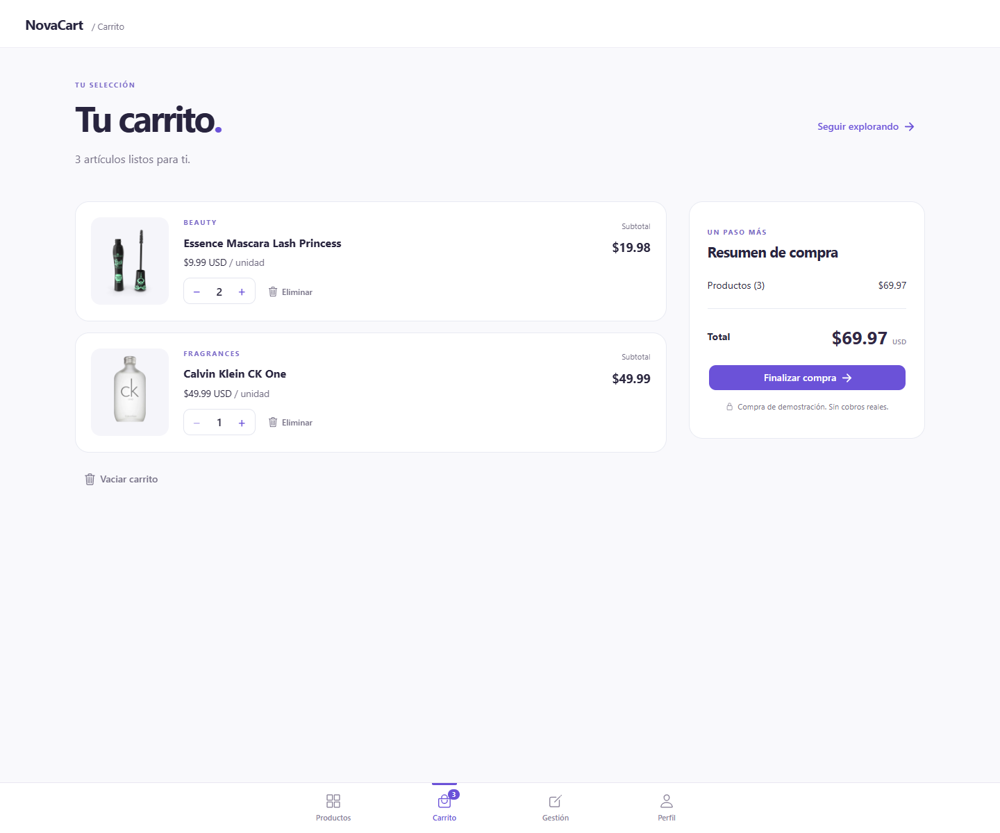
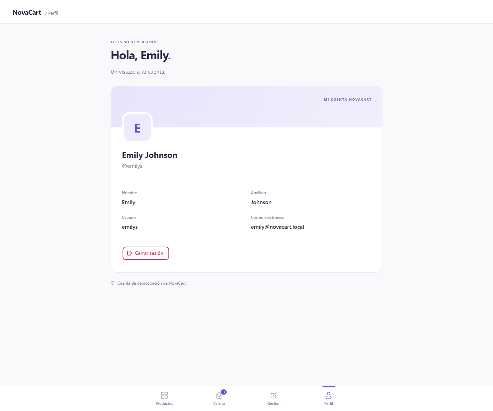
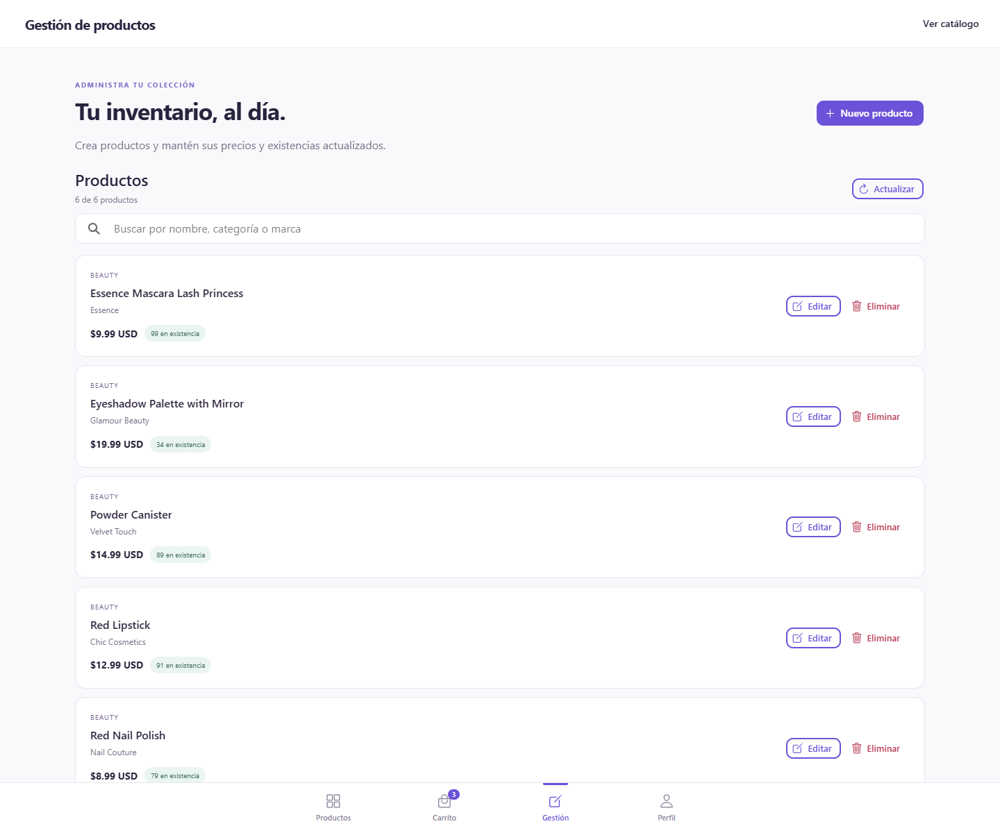
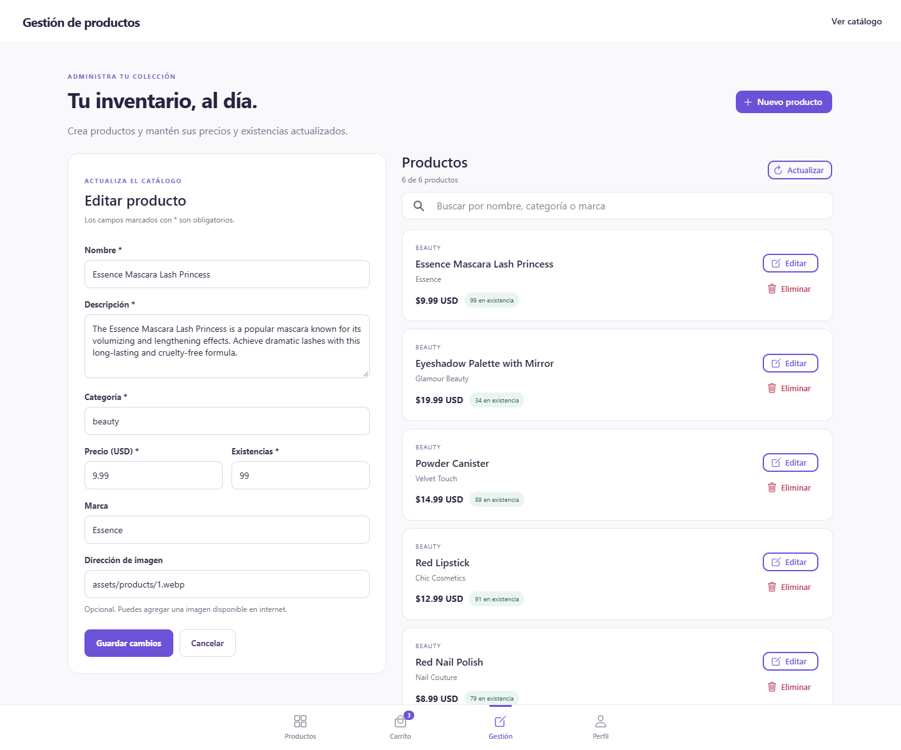

# NovaCart

Aplicación académica de comercio electrónico con **Ionic, Angular, TypeScript, Axios y una API propia con SQLite**. Incluye login, catálogo, detalle, carrito, perfil e inventario para crear, consultar, actualizar y eliminar productos persistidos.

**Entrega revisada: 21 de septiembre de 2026.** La capa de acceso a datos está formada por servicios inyectables de Angular: `ProductsService`, `AuthService` y `CartService`. Las pantallas Ionic consumen sus métodos y objetos tipados.

## Ejecutar el proyecto

Desde la raíz del repositorio, con Node.js 24 desde 24.15.0 y npm 11.19.1 o posterior:

```bash
npm ci
npm run dev
```

Abre **http://localhost:8100**. Este comando compila la API TypeScript y ejecuta el servidor en el puerto 3001 y Angular en el 8100. La base de datos y los datos de demostración se crean automáticamente en el primer arranque. No se requiere instalar un servidor de base de datos ni Ionic CLI global.

```text
Usuario: emilys
Contraseña: emilyspass
```

El botón **Usar cuenta de demostración** rellena esos datos; **Ingresar** autentica contra la API local. Son credenciales de la cuenta académica incluida en la inicialización.

Para trabajar con los procesos por separado:

```bash
# Terminal 1: compilar e iniciar la API
npm run api
```

```bash
# Terminal 2: iniciar Angular
npm start -- --port 8100
```

Angular recarga los cambios del frontend. Después de modificar el servidor TypeScript, reinicia `npm run api` o `npm run dev` para volver a compilarlo.

Para probar la compilación de producción, detén los procesos anteriores y ejecuta:

```bash
npm run serve:prod
```

Abre **http://127.0.0.1:3001**. El mismo servidor entrega `www/` y `/api`. También puedes compilar sin iniciar procesos mediante `npm run build` y `npm run build:api`.

## Pantallas y objetos TypeScript

| Pantalla | Ruta | Objetos e interfaces | Funcionalidad |
| --- | --- | --- | --- |
| Login | `/login` | `LoginCredentials`, `LoginRequest`, `AuthResponse`, `User`. | Validar formulario, iniciar sesión y manejar errores. |
| Catálogo | `/home` | `Product[]`, `ProductListResult`. | Consultar y buscar por título, categoría o marca; agregar al carrito. |
| Detalle | `/product/:id` | `Product`, `ProductDetailResult`. | Consultar características y existencias de un producto. |
| Carrito | `/cart` | `CartItem[]`, `Product`. | Agregar, cambiar cantidades, eliminar y vaciar; compra simulada. |
| Perfil | `/profile` | `User`. | Consultar perfil y cerrar sesión. |
| Inventario | `/inventory` | `Product[]`, `ProductInput`, `ApiError`. | CRUD persistente de productos, validación y confirmación de eliminación. |

`PagePhase` tipa las fases `idle`, `loading`, `saving`, `success` y `error` en Login e Inventario. Las otras páginas conservan indicadores booleanos de carga o diálogo. Las interfaces se comparten entre servicios, objetos y pantallas; [INTERFACES_TYPESCRIPT.md](docs/INTERFACES_TYPESCRIPT.md) enumera sus nombres, campos, archivos y ejemplos concretos.

Las rutas de las pantallas privadas están protegidas y `/products` redirige a `/home`. La navegación incluye Productos, Carrito, Gestión y Perfil; **Gestión** abre la pantalla Inventario.

## Probar el CRUD desde la pantalla

1. Inicia sesión y entra en **Gestión (Inventario)**.
2. Pulsa **Nuevo producto**, completa nombre, descripción, categoría, precio y existencias, y guarda.
3. Busca el producto en el listado o en **Productos** para consultarlo.
4. Vuelve a **Gestión (Inventario)**, selecciona **Editar**, cambia sus datos y guarda.
5. Recarga la página para comprobar que la modificación permanece en SQLite.
6. Selecciona **Eliminar** en el producto de práctica y confirma; desaparecerá del catálogo.

El servidor valida las solicitudes aunque se omita el formulario. El precio acepta hasta dos decimales y las existencias son enteros no negativos. Las escrituras no se simulan si falla la API. Cualquier usuario autenticado puede administrar los productos; esta entrega no implementa roles.

## APIs creadas

Base local: `http://127.0.0.1:3001/api`. El cliente Axios utiliza `/api`, con proxy de Angular durante el desarrollo y el mismo origen en el compilado.

| Método | Endpoint | Resultado |
| --- | --- | --- |
| `GET` | `/api/health` | Estado del servidor. |
| `POST` | `/api/auth/login` | Usuario y `accessToken`. |
| `GET` | `/api/auth/me` | Perfil autenticado. |
| `POST` | `/api/auth/logout` | Revocar sesión. |
| `GET` | `/api/products` | Listado completo de productos. |
| `GET` | `/api/products/:id` | Consultar un producto. |
| `POST` | `/api/products` | Crear un producto. |
| `PUT` | `/api/products/:id` | Actualizar sus campos editables. |
| `DELETE` | `/api/products/:id` | Eliminar un producto. |

Perfil, logout y todas las operaciones de productos requieren `Authorization: Bearer <accessToken>`. El [documento de API](docs/API.md) incluye cuerpos, respuestas, validaciones y códigos HTTP. [api-ejemplos.http](docs/api-ejemplos.http) permite recorrer login y CRUD con el token y el identificador de las respuestas.

## Base de datos y persistencia

[server/schema.sql](server/schema.sql) define `users`, `sessions` y `products`. La base predeterminada es `server/data/novacart.sqlite`; los precios se guardan en centavos. `sessions.user_id` y `products.created_by` referencian a `users.id`. El [modelo de datos](docs/MODELO_DATOS.md) incluye el diagrama Mermaid, el diccionario de entidades y su correspondencia con los objetos TypeScript.

La primera inicialización inserta la cuenta demo y seis productos con imágenes locales. Los cambios del inventario permanecen después de reiniciar. Los productos borrados no se vuelven a insertar por reiniciar el servidor. `DB_PATH` permite usar otro archivo SQLite y `PORT` cambia el puerto al ejecutar la API por separado.

La contraseña se guarda como hash con sal; las sesiones son revocables y sus tokens se comprueban en el servidor. El archivo `server/data/novacart.sqlite.secret` conserva la clave de firma junto a la base. Esos archivos de ejecución están excluidos de Git.

El navegador guarda `novacart.accessToken`, `novacart.user` y `novacart.cart`. Cerrar sesión elimina token y usuario y conserva el carrito. El carrito contiene copias locales de los productos; no representa una reserva de inventario. **La compra es una simulación: no procesa cobros, no crea pedidos ni descuenta stock en SQLite.** Los importes se muestran en USD.

Ante errores de red o respuestas 5xx, catálogo y detalle pueden usar seis productos de respaldo con un aviso visible. Los errores 4xx no activan ese respaldo. Inventario y sus escrituras requieren la API.

## Estructura

```text
src/app/
  models/              Interfaces y tipos compartidos
  core/api/            Cliente Axios y almacenamiento de sesión
  services/            AuthService, ProductsService y CartService
  guards/              Protección de rutas
  pages/               Login, catálogo, detalle, carrito, perfil e inventario
  data/                Productos de demostración y respaldo
server/
  schema.sql           Tablas, claves foráneas y restricciones
  types.ts             Interfaces internas del servidor
  database.ts          SQLite, inicialización y operaciones de persistencia
  auth.ts              Verificación de contraseña y sesiones
  validation.ts        Validación de entradas y errores HTTP
  app.ts               Rutas HTTP y entrega del frontend
  index.ts             Configuración y arranque
  tests/               Comprobaciones de API
scripts/               Arranque conjunto, navegador y capturas
docs/                  Documentación académica y evidencia visual
```

Angular conserva NgModules y componentes `standalone: false`. Los objetos expuestos mediante signals actualizan las plantillas Ionic. Las interfaces de transporte de `src/app/models` también se importan desde el servidor; su validación durante la ejecución se implementa explícitamente.

## Verificación

```bash
npm test -- --watch=false
npm run test:api
npm run lint
npm run build
npm run build:api
```

Con `npm run dev` ejecutándose en otra terminal:

```bash
npm run test:e2e
npm run screenshots
```

Los scripts de navegador usan Chrome instalado o Chromium de Playwright; si ninguno está disponible, ejecuta `npx playwright install chromium`. La variable `BASE_URL` permite cambiar la dirección; en PowerShell: `$env:BASE_URL = 'http://localhost:8100'`. `CHROME_CHANNEL` permite seleccionar un canal de navegador compatible.

[VERIFICACION.md](docs/VERIFICACION.md) registra los resultados realmente ejecutados y sus límites. Los archivos temporales de revisión se escriben en `artifacts/browser/`; las capturas de entrega están en `docs/screenshots/`.

## Documentos de entrega

- [Interfaces TypeScript, objetos y fases de las pantallas](docs/INTERFACES_TYPESCRIPT.md).
- [Servicios Angular de acceso a datos, inyección y operaciones CRUD](docs/SERVICIOS_DATOS.md).
- [APIs, autenticación y operaciones CRUD](docs/API.md), con [peticiones de ejemplo](docs/api-ejemplos.http).
- [Modelo de datos y diagramas de entidades y clases](docs/MODELO_DATOS.md).
- [Cómo se utilizó IA para generar y revisar el modelo](docs/USO_IA_MODELO.md).
- [Verificación de funcionamiento](docs/VERIFICACION.md).

[EVIDENCIA_IA.md](docs/EVIDENCIA_IA.md) y [PROMPTS_DESARROLLO.md](docs/PROMPTS_DESARROLLO.md) conservan el registro histórico anterior del 11 de septiembre de 2026, cuando se usaba DummyJSON. Los documentos enlazados en esta sección describen la versión actual con servidor propio.

## Capturas de la aplicación

| Login | Catálogo |
| --- | --- |
|  |  |

| Detalle | Carrito |
| --- | --- |
|  |  |

| Perfil | Inventario |
| --- | --- |
|  |  |


