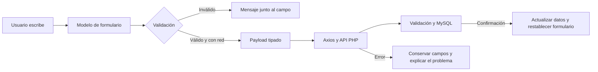

# Actividad: Data Driven en NovaCart

Fecha: 1 de octubre de 2026. Aplicación: Angular/Ionic, Axios, PHP y MySQL.

## Objetivo y alcance

Aplicar Data Driven como **formularios reactivos de Angular definidos desde el modelo**. En esta actividad el modelo TypeScript controla los valores, la validación y los estados del formulario; el HTML representa ese modelo. Esta interpretación corresponde al enfoque *model-driven* descrito en la [documentación oficial de formularios reactivos de Angular](https://angular.dev/guide/forms/reactive-forms).

Se trabajó sobre las cuatro pantallas existentes: login, registro, usuarios y carrito. El resumen solicitado —objetivo, prompt, trabajo realizado y resultado— está en [RESUMEN_DATA_DRIVEN.md](RESUMEN_DATA_DRIVEN.md).

## Implementación

| Elemento | Aplicación concreta |
| --- | --- |
| `ReactiveFormsModule` | Habilita `[formGroup]`, `formControlName`, `formArrayName` y `formGroupName`. Se sustituyó el uso de `ngModel` y `ngForm`. |
| `FormBuilder.nonNullable` | Crea los formularios de login y usuario con controles tipados de texto que no se convierten en `null` al restablecerse. |
| `FormGroup` y `FormControl` | Agrupan los campos y conservan valores, errores y estados en TypeScript. |
| Metadatos | `USER_FIELD_DEFINITIONS` define nombres, etiquetas, tipos y ayudas. El formulario de Usuarios genera sus campos a partir de esta colección. |
| Validadores | Requeridos, longitud, formato de usuario, correo, caracteres de control y contraseña válida. Las reglas se comparten entre registro y administración de usuarios. |
| Validación entre campos | La confirmación debe coincidir con la contraseña. La confirmación es un dato de interfaz y no se envía a PHP. |
| Reglas dinámicas | La contraseña es obligatoria al crear una cuenta y opcional al editarla; si se cambia, debe validarse y confirmarse. |
| Estados | Se utilizan `valid`, `invalid`, `pending`, `disabled`, `dirty`, `touched` y `pristine` para controlar validación, errores y envíos. |
| Observación de cambios | Una suscripción a los eventos del formulario actualiza los mensajes y estados en Angular sin Zone.js; se libera al destruir la página. |
| `patchValue` y `reset` | Precarga de cuenta demo, edición de usuarios, cancelación y limpieza de contraseñas después del éxito. |
| `getRawValue` | Construye el cuerpo de la solicitud a partir del modelo. Se normalizan campos de texto, se conservan las contraseñas intactas y se excluye su confirmación. |
| `FormArray` | El carrito crea un grupo de cantidad por artículo. Al agregar o quitar artículos se reconstruye la colección manteniendo la correspondencia entre fila y control. |
| Errores API | Los errores 400/422 asociados a campos conocidos aparecen junto al campo; se puede corregir y volver a enviar. Los detalles técnicos se filtran. |
| Accesibilidad | Etiquetas asociadas, mensajes por campo, `aria-invalid`, `aria-describedby` y avisos de carga/error. |
| Fallos de conexión | Se conserva la estrategia anterior: caché, consulta offline, bloqueo de escrituras sin red y formularios conservados ante fallos. |

La API y MySQL siguen validando y guardando los datos. La validación del navegador mejora la interacción y evita solicitudes inválidas; no sustituye la validación del servidor.

## Reglas del modelo

| Campo | Regla |
| --- | --- |
| Usuario nuevo | De 3 a 100 letras ASCII, números, puntos, guiones o guion bajo. |
| Nombre y apellido | Contenido obligatorio, hasta 100 caracteres, sin caracteres de control. |
| Correo | Obligatorio, formato válido y hasta 254 caracteres. |
| Contraseña de alta | De 8 a 200 caracteres; no puede contener solo espacios ni caracteres de control. Los espacios legítimos se conservan. |
| Contraseña de edición | Vacía conserva la anterior; una nueva contraseña cumple las reglas de alta. |
| Confirmación | Debe coincidir exactamente cuando se establece una contraseña. |
| Login | Requeridos y límites de longitud, sin imponer nuevamente las reglas de alta a una contraseña ya existente. |
| Cantidad | Número entero desde 1 hasta el menor valor entre existencias y 99. Para eliminar un artículo se utiliza **Quitar**. |

La longitud de los textos se cuenta mediante puntos Unicode, de forma coherente con `mb_strlen` en PHP. Las reglas de formulario están definidas en TypeScript, evitando límites duplicados en HTML que cuenten esos caracteres de otra manera.

## Flujo de funcionamiento



Durante un envío se bloquean los controles y los métodos impiden solicitudes duplicadas. Una respuesta exitosa limpia las contraseñas. Un fallo conserva los campos para su corrección. En el carrito, el total mostrado corresponde a la última respuesta confirmada del servidor; escribir una cantidad nueva no cambia ese total hasta guardarla correctamente. Al guardar una fila se conservan los borradores de otras filas.

## Archivos principales

- [Modelo compartido y validadores](../src/app/core/forms/form-models.ts).
- [Login](../src/app/pages/login/login.page.ts) y [registro](../src/app/pages/register/register.page.ts).
- [Usuarios](../src/app/pages/home/home.page.ts) y [plantilla generada desde metadatos](../src/app/pages/home/home.page.html).
- [Carrito con FormArray](../src/app/pages/cart/cart.page.ts).
- [Pruebas del modelo](../src/app/core/forms/form-models.spec.ts) y pruebas de cada página.
- [Pruebas de navegador Data Driven](../scripts/verify-data-driven.mjs).

## Pruebas y evidencia

```powershell
npm test -- --watch=false
npm run lint
npm run deploy:xampp
npm run test:data-driven
npm run test:e2e
npm run test:offline
```

`test:data-driven` simula las respuestas de la API en contextos independientes del navegador: prueba la interfaz y sus solicitudes con conjuntos de datos deterministas, sin modificar MySQL. Las pruebas existentes `test:e2e` y `test:offline` comprueban además la integración real y la continuidad de la actividad anterior.

El reporte Data Driven se guarda en [data-driven-verificacion.json](evidencia/data-driven-verificacion.json) y sus capturas en `docs/screenshots-data-driven/`. Cada reporte distingue datos simulados de integración real. Los registros de las pruebas no incluyen contraseñas ni tokens.

**Verificación del 2 de octubre de 2026:** 208 pruebas unitarias en 13 archivos, 6 pruebas del service worker, 26 comprobaciones de API, 5 escenarios de integración, 7 escenarios de conexión y 4 escenarios Data Driven aprobados. También pasaron lint y la compilación de producción desplegada en XAMPP. Los resultados de esta entrega se reúnen en [ENTREGA_PROYECTO_IONIC.md](../ENTREGA_PROYECTO_IONIC.md).

Evidencias visuales: [validación en móvil](screenshots-data-driven/02-registro-validacion-local-movil.png), [cantidad inválida](screenshots-data-driven/05-carrito-cantidad-invalida.png), [fila correcta después de eliminar otra](screenshots-data-driven/06-carrito-fila-reindexada.png) y [borrador conservado ante HTTP 503](screenshots-data-driven/07-carrito-borrador-conservado.png).

Para obtener evidencia manual:

1. Abre `http://localhost/novacart/register`, escribe un usuario con espacios, un correo inválido y dos contraseñas distintas. Toca los campos para ver los errores y captura el botón de registro bloqueado.
2. Corrige los campos y confirma la misma contraseña: los mensajes desaparecen y el registro queda habilitado.
3. Inicia sesión, edita un usuario y observa que la contraseña vacía permite conservar la actual. Cancela para regresar al modo de alta, donde vuelve a ser obligatoria.
4. En el carrito, agrega artículos y escribe una cantidad decimal, cero o mayor a las existencias: se muestra el error y se bloquea **Guardar cantidad**. Corrige la cantidad y comprueba que se actualice solo después de guardar.
5. Conserva una captura de recuperación ante un fallo usando `npm run test:data-driven`, o repite la prueba offline documentada en [CONEXION_Y_CACHE.md](CONEXION_Y_CACHE.md).

Si tenías una versión anterior abierta, cierra todas sus pestañas y vuelve a abrir la aplicación para que se active la versión nueva del service worker.

## Bitácora de apoyo de IA

Los prompts siguientes son extractos de instrucciones realmente utilizadas en esta sesión. El prompt original del usuario está transcrito en el resumen.

### 1. Validación repartida entre HTML y TypeScript

**Problema encontrado:** los formularios utilizaban `ngModel`. Registro comprobaba solo parte de las reglas dentro del método, y `saveUser()` dependía de la validez del botón HTML; una llamada directa podía enviar un modelo inválido.

**Qué quería que hiciera la IA:** centralizar el modelo y las reglas para que los métodos validaran antes de llamar al servidor.

**Prompt utilizado:** «Implementa núcleo Data Driven/model-driven Angular Reactive Forms para NovaCart. […] Usa FormBuilder nonNullable/Validators y validadores custom coherentes server/validation.php».

**Resultado:** factorías de formularios tipados, validadores compartidos, mensajes por campo y pruebas que llaman a los métodos directamente y comprueban que no se envíen datos inválidos.

### 2. Crear y editar no requieren la misma contraseña

**Problema encontrado:** al crear un usuario hay que exigir contraseña; al editarlo debe poder conservarse la anterior. La nueva confirmación debía validarse sin convertirse en un campo enviado a la API.

**Qué quería que hiciera la IA:** cambiar las reglas según el modo del formulario y separar el modelo de pantalla del cuerpo enviado al servidor.

**Prompt utilizado:** «setUserFormMode(form,mode) cambia requeridos contraseña/confirm en edición opcional, cross validation equality; userInputFromForm(form):UserInput normaliza strings texto trim y excluye confirmPassword».

**Resultado:** creación y edición comparten un formulario con reglas dinámicas. La confirmación solo se usa en la interfaz, una contraseña vacía en edición se omite y las contraseñas reales conservan sus espacios.

### 3. Los errores por campo se perdían al habilitar el formulario

**Problema encontrado:** habilitar controles vuelve a ejecutar sus validadores y puede reemplazar los errores que se asignaron desde una respuesta del servidor.

**Qué quería que hiciera la IA:** conservar los errores API hasta que el usuario corrigiera el campo correspondiente, sin dejar el formulario bloqueado después de un fallo.

**Prompt utilizado:** «Estado touched/dirty/submitted, markAllAsTouched si submitinválido, guardiasTS impiden APIcall invalid/inflight/offline; form.disable duranteenvío y enable finally» y «serverfield errors correction, disable/restoration trasnetworkfailure».

**Resultado:** los controles se habilitan antes de asignar los errores del servidor. Los mensajes seguros se asocian únicamente a campos conocidos, se limpian al corregir esos campos y se comprueban con pruebas unitarias y de navegador.

### 4. Filas dinámicas del carrito y controles por índice

**Problema encontrado:** conservar una fila por ID del producto mientras `formGroupName` utiliza un índice puede dejar su control asociado al índice anterior al eliminar la primera fila.

**Qué quería que hiciera la IA:** revisar la correspondencia entre los artículos y sus controles y probar la eliminación seguida de una edición.

**Prompt utilizado:** «Busca bugs reales en validación, disable/enable, confirmar, reset, conservación drafts, errorhandler401, FormArray al cambiaritems» y «2items; intercept DELETE primero respondiendo cartsegundo, verifica input del sobreviviente edita y PUT lleva productIdcorrecto/cantidadcorrecta».

**Resultado:** las filas del `FormArray` se siguen por índice. Una prueba en navegador elimina el primer artículo, edita el restante y comprueba la URL y cantidad enviadas; otra comprueba la conservación del borrador ante HTTP 503.
