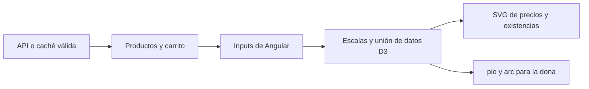

# Tres gráficas con D3.js en NovaCart

Actividad realizada el 5 de octubre de 2026. Se instaló `d3` 7.9.0 y `@types/d3` para utilizar la biblioteca desde Angular con TypeScript.

## Dónde verlas

Abre `http://localhost/novacart/`, inicia sesión y entra en **Carrito**. Después del catálogo y los artículos guardados encontrarás las tres gráficas. Para ver la dona con varios segmentos, agrega dos productos distintos y guarda sus cantidades.

| Gráfica | Datos utilizados | Cómo leerla |
| --- | --- | --- |
| Precios del catálogo | `Product.title` y `Product.price` | Barras horizontales: una barra más larga representa un precio mayor, en MXN. |
| Existencias disponibles | `Product.title` y `Product.stock` | Barras verticales: su altura representa las unidades disponibles informadas por la API. |
| Distribución del importe | `CartItem.price × CartItem.quantity` | Dona: cada segmento representa la parte del importe que corresponde a un artículo del carrito. |

Las gráficas representan el catálogo y el carrito actual. No representan ventas históricas ni ingresos. Cambiar una cantidad sin guardar conserva la gráfica anterior; una respuesta exitosa del servidor actualiza los artículos y vuelve a dibujar la dona. La búsqueda filtra las tarjetas del catálogo, mientras las gráficas conservan el conjunto completo de datos cargados.

## Dónde está el código

| Archivo | Responsabilidad |
| --- | --- |
| [package.json](../package.json) | Declara `d3`, `@types/d3` y el comando `test:d3`. |
| [cart-charts.component.ts](../src/app/core/cart-charts.component.ts) | Componente de Angular que transforma los datos y dibuja los SVG con D3. |
| [cart-charts.component.html](../src/app/core/cart-charts.component.html) | Aloja los tres SVG, los mensajes, las leyendas y las tablas equivalentes. |
| [cart.page.ts](../src/app/pages/cart/cart.page.ts) | Obtiene productos y carrito mediante `CartService`; recibe los resultados de cambios confirmados. |
| [cart.page.html](../src/app/pages/cart/cart.page.html) | Integra `<app-cart-charts>` y le entrega productos, artículos y estado de carga/caché. |
| [design.scss](../src/design.scss) | Distribuye las tarjetas de gráficas, adapta su tamaño y define leyendas y tablas. |
| [verify-d3.mjs](../scripts/verify-d3.mjs) | Verifica en navegador las tres gráficas, actualización, fallo 503, valores cero, búsquedas y diseño adaptable. |

Los modelos de entrada están en [product.model.ts](../src/app/models/product.model.ts) y [cart-item.model.ts](../src/app/models/cart-item.model.ts).

Dentro de `CartChartsComponent`, **`renderPrices()`** dibuja precios, **`renderStocks()`** dibuja existencias y **`renderCart()`** dibuja la dona. `render()` llama a los tres métodos. `cartAmounts` calcula cada subtotal y `cartTotal` su suma. `ngAfterViewInit()` inicia el dibujo una vez que los SVG existen; `ngOnChanges()` lo actualiza cuando el padre entrega nuevos datos.

## Cómo funciona

1. `CartService` consulta la API PHP o recupera una copia válida cuando hay un fallo de conexión. El componente padre recibe listas tipadas de productos y artículos.
2. Angular pasa estas listas al componente de gráficas mediante sus propiedades de entrada. Al crear la vista o cambiar los datos, el componente actualiza el dibujo.
3. D3 selecciona los SVG del componente. `scaleLinear` convierte precios y existencias en posiciones o tamaños; `scaleBand` reserva una posición por producto. Los ejes permiten comparar valores.
4. La unión de datos con `.data(...).join(...)` relaciona cada producto con una barra o segmento mediante su identificador. Si cambia una lista, D3 actualiza, añade o elimina elementos; no acumula dibujos duplicados.
5. Para la dona, `pie()` transforma los subtotales en ángulos y `arc()` produce los trazos SVG. Un radio interior deja el hueco central. El porcentaje de un artículo es `subtotal / suma de subtotales × 100`.



Los SVG usan `viewBox` para ajustarse a la pantalla. Los valores exactos también se pueden consultar en tablas. Los títulos de las marcas y las leyendas explican los datos sin depender únicamente del color.

Si el catálogo está vacío, se explica que faltan datos para dibujar. Si el carrito está vacío o su importe total es cero, no se inventan segmentos ni porcentajes. Cuando se muestra caché, las gráficas reflejan esa copia y se indica que los datos pueden estar desactualizados. D3 forma parte del build de la aplicación: no necesita descargar una biblioteca desde un CDN para dibujar offline.

## Instalación y comprobación

```powershell
npm install d3
npm install --save-dev @types/d3
npm run deploy:xampp
npm run test:d3
```

En una copia nueva del repositorio basta `npm ci`, porque las dependencias ya están declaradas. La verificación de D3 utiliza una API simulada en sus propios contextos y no modifica MySQL. Su reporte queda en [d3-verificacion.json](evidencia/d3-verificacion.json) y las capturas en `docs/screenshots-diseno/`. El funcionamiento de conexión y caché se comprueba además con `npm run test:offline`.

**Resultados del 5 de octubre de 2026:** 225 pruebas unitarias en 14 archivos, 4 escenarios D3/diseño, 4 escenarios de formularios, 5 escenarios de integración y 7 escenarios de conexión aprobados. Pasaron también las 6 pruebas del service worker, lint y el despliegue de producción en XAMPP. La prueba sin conexión comprobó explícitamente que las barras de precios y existencias se dibujaran después de recargar offline. El [reporte consolidado](evidencia/diseno-d3-verificacion.json) identifica comandos y alcances.

Evidencias visuales: [carrito con las tres gráficas](screenshots-diseno/04-carrito-graficas-1440.png), [vista móvil](screenshots-diseno/04-carrito-graficas-390.png), [datos conservados ante un fallo](screenshots-diseno/05-carrito-error-conservado.png) e [inicio de sesión renovado](screenshots-diseno/01-login-1440.png).

## Objetivo, prompt y resultado del apoyo de IA

**Lo que quería hacer:** instalar D3.js en el proyecto y presentar al menos tres gráficas útiles, integradas con el carrito y explicadas mediante sus archivos y flujo de datos.

**Prompt del usuario:**

> quiero que en este proyecto instales D3.js y pongas aunque sea 3 graficas usando eso y me expliques donde estane en el codigo y como funciona

**Resultado:** integración de D3 mediante npm y TypeScript, dos gráficas de barras del catálogo y una dona del importe del carrito. Se añadieron estados sin datos, tablas equivalentes, diseño adaptable, actualización tras cambios confirmados y pruebas de navegador. La renovación visual incluye además navegación compartida, búsquedas de usuarios y productos y controles para mostrar u ocultar contraseñas.

Referencias oficiales: [instalación de D3](https://d3js.org/getting-started), [unión de datos](https://d3js.org/d3-selection/joining) y [cálculo de segmentos con pie](https://d3js.org/d3-shape/pie).
