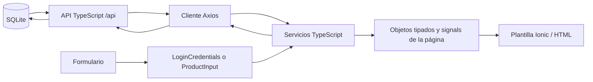

> Documento de la version anterior. La entrega vigente usa cuatro pantallas y PHP/MySQL: [guia actual](PROYECTO_SIMPLE.md).

# Interfaces, objetos y fases de las pantallas

**Actualización: 21 de septiembre de 2026.** Las interfaces propias de la aplicación se encuentran en [src/app/models](../src/app/models). Las pantallas importan esos contratos; los servicios reciben o devuelven objetos con ellos y las plantillas HTML muestran sus propiedades.

Una **interfaz** describe la forma de un dato; un **objeto** es un valor concreto que cumple esa forma. Por ejemplo, `LoginCredentials` es la interfaz y `{ username: 'emilys', password: 'emilyspass' }` es un objeto. La **fase** indica qué está haciendo una pantalla y se describe mediante `PagePhase`.

## Inventario de interfaces de la aplicación

`?` indica un campo opcional. Los nombres respetan las declaraciones del código.

| Interfaz | Archivo | Campos | Responsabilidad |
| --- | --- | --- | --- |
| `User` | [user.model.ts](../src/app/models/user.model.ts) | `id: number`, `username: string`; `email?`, `firstName?`, `lastName?`, `image?: string`. | Datos públicos del usuario que utiliza el perfil. |
| `LoginCredentials` | [auth-request.model.ts](../src/app/models/auth-request.model.ts) | `username: string`, `password: string`. | Objeto construido a partir del formulario de login. No se persiste la contraseña. |
| `LoginRequest extends LoginCredentials` | [auth-request.model.ts](../src/app/models/auth-request.model.ts) | Campos de `LoginCredentials` y `expiresInMins?: number`. | Cuerpo de `POST /api/auth/login`. |
| `AuthResponse extends User` | [auth-response.model.ts](../src/app/models/auth-response.model.ts) | Campos de `User` y `accessToken: string`. | Resultado del login. La API propia no devuelve `refreshToken`. |
| `Product` | [product.model.ts](../src/app/models/product.model.ts) | `id: number`; `title`, `description`, `category: string`; `price: number`; `discountPercentage?`, `rating?`, `stock?: number`; `brand?`, `thumbnail?: string`; `images?: string[]`. | Producto consultado que utilizan catálogo, detalle, inventario y carrito. |
| `ProductInput` | [product-input.model.ts](../src/app/models/product-input.model.ts) | `title`, `description`, `category: string`; `price`, `stock: number`; `brand?`, `thumbnail?: string`. | Datos editables al crear o actualizar un producto. No acepta `id` ni autor. |
| `ProductsResponse` | [product.model.ts](../src/app/models/product.model.ts) | `products: Product[]`, `total: number`, `skip: number`, `limit: number`. | Respuesta HTTP del listado de productos. |
| `ProductListResult` | [product.model.ts](../src/app/models/product.model.ts) | `products: Product[]`, `source: ProductSource`. | Resultado del servicio para la pantalla de catálogo; añade la procedencia de los datos. |
| `ProductDetailResult` | [product.model.ts](../src/app/models/product.model.ts) | `product: Product`, `source: ProductSource`. | Resultado del servicio para la pantalla de detalle. |
| `CartItem` | [cart-item.model.ts](../src/app/models/cart-item.model.ts) | `product: Product`, `quantity: number`. | Línea del carrito local: una copia de producto y la cantidad seleccionada. |
| `ApiError` | [api-error.model.ts](../src/app/models/api-error.model.ts) | `message: string`, `errors?: Record<string, string>`. | Error de la API; `errors` asocia un nombre de campo con su mensaje de validación. |

Las interfaces `ProductListResult` y `ProductDetailResult` son resultados del servicio del cliente; la API no envía el campo `source`. El servicio lo agrega para distinguir la API propia del respaldo local.

## Tipos auxiliares

Estos nombres son alias `type`, no declaraciones `interface`:

```typescript
// src/app/models/product.model.ts
export type ProductSource = 'api' | 'local';

// src/app/models/view-state.model.ts
export type PagePhase = 'idle' | 'loading' | 'saving' | 'success' | 'error';

// src/app/pages/inventory/product-form.ts
export type ProductFormErrors = Partial<Record<keyof ProductInput, string>>;
```

| Fase | Significado |
| --- | --- |
| `idle` | Aún no hay una operación iniciada o el formulario espera una acción. |
| `loading` | Se están consultando datos. |
| `saving` | Se está enviando una operación que modifica el estado. |
| `success` | La operación terminó correctamente. |
| `error` | Falló la operación; la pantalla muestra el mensaje correspondiente. |

`ProductFormErrors` asocia los campos de `ProductInput` con mensajes opcionales de validación. Por ejemplo, `{ stock: 'Introduce un entero no negativo.' }` permite mostrar el error junto al campo de existencias.

Login e Inventario usan `PagePhase`. Las otras pantallas conservan sus estados booleanos de carga y diálogo, detallados a continuación. `source` y el estado de carga resuelven problemas diferentes: el catálogo puede cargar correctamente con `source: 'local'` si se activó el respaldo de lectura.

## Pantalla, objeto, interfaz y fase

| Pantalla y archivo | Objetos concretos en el código | Interfaces que reciben o producen | Servicio y estado |
| --- | --- | --- | --- |
| Login: [login.page.ts](../src/app/pages/login/login.page.ts), `/login` | `credentials` se obtiene con `form.getRawValue()`; el servicio construye `request` y recibe `data`. | `LoginCredentials` → `LoginRequest` → `AuthResponse` → `User`. | `AuthService.login(credentials)`. `phase: PagePhase`: `idle` → `loading` → `success` o `error`; `loading` se deriva de la fase. |
| Catálogo: [home.page.ts](../src/app/pages/home/home.page.ts), `/home` | `products: signal<Product[]>`, `result.products`, `result.source`; `filteredProducts` alimenta las tarjetas. | `ProductListResult`, `Product[]`; el servicio interpreta `ProductsResponse`. | `ProductsService.getProducts()`. `loading: boolean`, `error: string`, `source: ProductSource`; consulta al entrar. |
| Detalle: [product-detail.page.ts](../src/app/pages/product-detail/product-detail.page.ts), `/product/:id` | `product: signal<Product \| null>`; toma `result.product` según el parámetro `id`. | `ProductDetailResult`, `Product`. | `ProductsService.getProduct(id)`. `loading`, `notFound` y `imageFailed`: booleanos; `error: string` y `source: ProductSource`. |
| Carrito: [cart.page.ts](../src/app/pages/cart/cart.page.ts), `/cart` | `cart.items()` devuelve las líneas del servicio; cada `item` contiene `item.product` e `item.quantity`. | `CartItem[]` y `Product`, tipados en `CartService` e inferidos al usarlos en la vista. | `CartService`: agregar, aumentar, disminuir, eliminar y vaciar. `dialogOpen: boolean` evita abrir varias confirmaciones simultáneas. |
| Perfil: [profile.page.ts](../src/app/pages/profile/profile.page.ts), `/profile` | `auth.user()` devuelve el usuario actual o `null`; los campos alimentan el perfil. | `User`, expuesto por `AuthService` e inferido en la vista. | `AuthService.getCurrentUser(): Promise<User>`. `loading` e `imageFailed`: booleanos; `error: string`. |
| Inventario: [inventory.page.ts](../src/app/pages/inventory/inventory.page.ts), `/inventory` | `products: signal<Product[]>`, `form: ProductInput`, `input: ProductInput`, `saved: Product`, `editingId: number \| null`, `fieldErrors: ProductFormErrors`. | `Product`, `ProductInput`, `ApiError`; el listado HTTP usa `ProductsResponse`. | `getInventory`, `createProduct`, `updateProduct`, `deleteProduct` de `ProductsService`. `phase: PagePhase`; `busy` combina `loading`, `saving` y `dialogOpen`. |

En Inventario, la lectura pasa de `loading` a `idle`; crear, editar y eliminar pasan de `saving` a `success`. Un fallo establece `error`; abrir o cancelar el formulario vuelve a `idle`. `editingId === null` significa crear; un número identifica el producto por actualizar. Las escrituras reciben la respuesta del servidor antes de modificar la lista mostrada.

No es necesario duplicar `User` o `CartItem` dentro de cada página: TypeScript conserva el tipo que expone el servicio. Los archivos `*.page.html` leen estos objetos y los formularios actualizan sus campos; las definiciones siguen centralizadas.

## Interfaces internas del servidor

Estas cinco interfaces de producción completan el inventario. No son modelos nuevos para las pantallas y no se devuelven como JSON completo al cliente.

| Interfaz | Archivo | Campos | Uso |
| --- | --- | --- | --- |
| `UserRecord` | [server/types.ts](../server/types.ts) | `user: User`, `passwordHash: string`, `passwordSalt: string`. | Resultado privado de buscar un usuario para verificar la contraseña. |
| `AuthenticatedSession` | [server/types.ts](../server/types.ts) | `user: User`, `tokenHash: string`. | Sesión validada; permite consultar al usuario y revocar el token. |
| `SessionClaims` | [server/types.ts](../server/types.ts) | `sub: number`, `exp: number`, `iat: number`, `jti: string`. | Contenido firmado del token: usuario, vencimiento, emisión e identificador aleatorio. `exp` e `iat` están en segundos Unix. |
| `ApplicationOptions` | [server/types.ts](../server/types.ts) | `databasePath: string`, `staticDirectory?: string`, `now?: () => number`. | Configuración al crear el servidor. El reloj opcional devuelve milisegundos y permite comprobar vencimientos. |
| `Application` | [server/app.ts](../server/app.ts) | `server: Server` de `node:http`; método `close(): Promise<void>`. | Servidor creado y cierre de sus conexiones y de SQLite. |

El mapeo SQL usa además el alias interno `DatabaseRow = Record<string, SQLOutputValue>` en [server/database.ts](../server/database.ts). No es una interfaz de entidad: representa las columnas devueltas por SQLite, que `toUser` y `toProduct` leen y transforman explícitamente.

El inventario incluye **11 interfaces compartidas de aplicación y 5 interfaces internas de servidor**. No incluye interfaces de Angular, Ionic, Axios o Node importadas de dependencias, ni clases de componentes y servicios, que son declaraciones de otra clase.

## Ejemplos de objetos

Estos valores ilustran los contratos; no son capturas de una respuesta de producción. El identificador real de un producto lo asigna SQLite.

```typescript
import { LoginCredentials, LoginRequest } from './models/auth-request.model';
import { ProductInput } from './models/product-input.model';
import { Product } from './models/product.model';
import { CartItem } from './models/cart-item.model';
import { ApiError } from './models/api-error.model';

const credentials: LoginCredentials = {
  username: 'emilys',
  password: 'emilyspass',
};

const request: LoginRequest = { ...credentials, expiresInMins: 60 };

const input: ProductInput = {
  title: 'Cuaderno de TypeScript',
  description: 'Cuaderno de 100 hojas para apuntes.',
  category: 'papeleria',
  price: 8.5,
  stock: 20,
  brand: 'NovaCart',
};

const product: Product = { id: 101, ...input };
const line: CartItem = { product, quantity: 2 };
const validationError: ApiError = {
  message: 'Los datos del producto no son válidos.',
  errors: { stock: 'El stock debe ser un entero no negativo.' },
};
```

## Cómo llegan los datos a las pantallas



La plantilla accede a los objetos del componente, por ejemplo `product.title` o `item.quantity`. Angular no busca información dentro de una interfaz: la interfaz ayuda al compilador a verificar los objetos que el servicio y la pantalla intercambian.

En el login, el formulario produce `LoginCredentials`; `AuthService` construye `LoginRequest`, recibe `AuthResponse`, separa el token y proyecta los datos permitidos a `User`. En el CRUD, el formulario produce `ProductInput`; `ProductsService` lo envía al servidor y recibe un `Product` con identificador. El resultado del listado HTTP es `ProductsResponse`; el servicio transforma esa respuesta en `ProductListResult` para el catálogo.

## Límites del tipado

TypeScript comprueba el uso de estos contratos durante la compilación. Una anotación como `api.get<Product>(...)` no valida por sí sola un JSON remoto: las interfaces desaparecen al generar JavaScript. Por eso el servidor valida las entradas HTTP y SQLite aplica sus restricciones, mientras que `toUser` y `CartService` verifican datos restaurados antes de utilizarlos.

El frontend y el servidor comparten las interfaces de transporte de `src/app/models`; las filas SQL tienen campos internos distintos. El [modelo de datos](MODELO_DATOS.md) explica la diferencia entre una entidad persistida y el objeto que recibe una pantalla.

La [documentación de servicios Angular](SERVICIOS_DATOS.md) relaciona estos contratos con las firmas de los métodos CRUD e incluye fragmentos reales de inyección y consumo desde Inventario.
