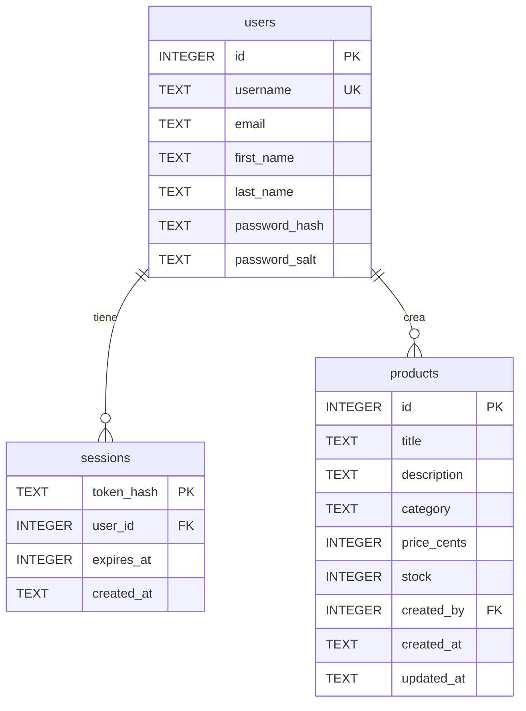
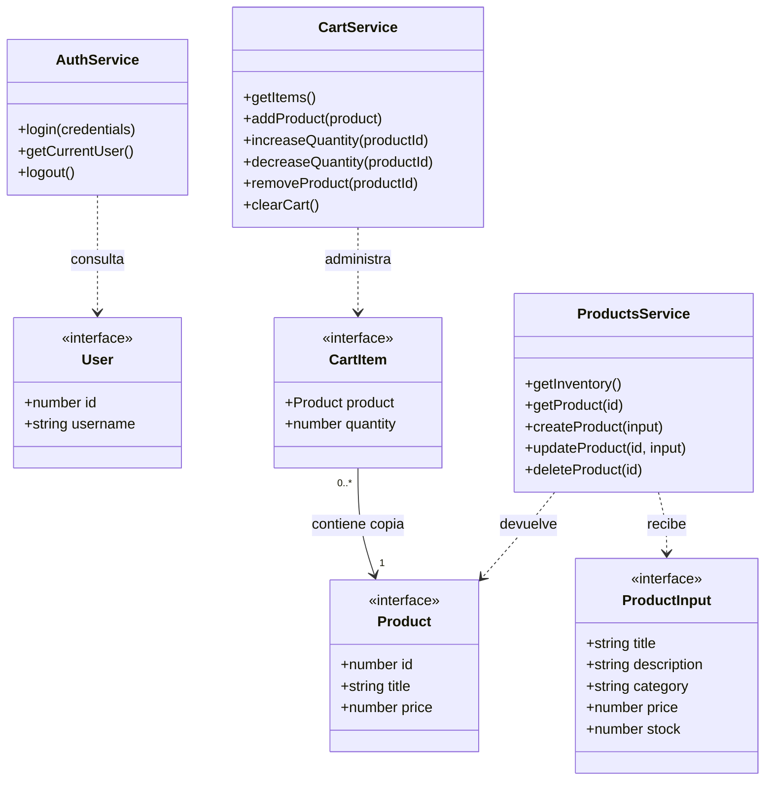

# Modelo de datos y diagrama de entidades

**Actualización: 21 de septiembre de 2026.** NovaCart utiliza una base SQLite propia para usuarios, sesiones y productos. El esquema ejecutable está en [server/schema.sql](../server/schema.sql). El carrito sigue almacenado en el navegador.

## Diagrama sencillo de la base de datos

El diagrama resume las tres tablas reales. Los campos adicionales se describen en las tablas siguientes.

Un usuario puede tener cero o muchas sesiones y crear cero o muchos productos. Cada sesión y cada producto pertenecen a un usuario existente. `created_by` registra al creador; no representa una compra ni una regla de propiedad exclusiva sobre el inventario.

## Diccionario de tablas

### `users`

| Columna SQL | Tipo | Regla y significado |
| --- | --- | --- |
| `id` | `INTEGER` | Clave primaria autoincremental. |
| `username` | `TEXT` | Obligatorio, único; entre 1 y 100 caracteres. |
| `email` | `TEXT` | Correo del usuario; obligatorio. |
| `first_name`, `last_name` | `TEXT` | Nombre y apellidos; obligatorios. |
| `image` | `TEXT` | Imagen del perfil; valor inicial `''`. |
| `password_hash`, `password_salt` | `TEXT` | Hash de contraseña y sal; obligatorios, de uso exclusivo del servidor. |
| `created_at` | `TEXT` | Fecha de creación, inicializada con `CURRENT_TIMESTAMP`. |

### `sessions`

| Columna SQL | Tipo | Regla y significado |
| --- | --- | --- |
| `token_hash` | `TEXT` | Clave primaria. Guarda el hash del token, no el token de acceso completo. |
| `user_id` | `INTEGER` | Obligatoria; referencia `users.id`. `ON DELETE CASCADE` elimina las sesiones si se borra su usuario. |
| `expires_at` | `INTEGER` | Fecha de vencimiento usada para rechazar sesiones caducadas. |
| `created_at` | `TEXT` | Fecha de creación, inicializada con `CURRENT_TIMESTAMP`. |

Hay índices sobre `user_id` y `expires_at`. Cerrar sesión invalida el acceso correspondiente en esta tabla. El proyecto no ofrece un endpoint para eliminar usuarios; la regla de borrado forma parte del modelo relacional.

### `products`

| Columna SQL | Tipo | Regla y significado |
| --- | --- | --- |
| `id` | `INTEGER` | Clave primaria autoincremental. |
| `title` | `TEXT` | Obligatorio; entre 1 y 160 caracteres después de quitar espacios extremos. |
| `description` | `TEXT` | Obligatoria; entre 1 y 2000 caracteres después de quitar espacios extremos. |
| `category` | `TEXT` | Obligatoria; entre 1 y 80 caracteres después de quitar espacios extremos. |
| `price_cents` | `INTEGER` | Precio en centavos; de 0 a 100 000 000. |
| `stock` | `INTEGER` | Existencias; de 0 a 1 000 000. |
| `brand` | `TEXT` | Marca, valor inicial `''`; máximo 120 caracteres. |
| `thumbnail` | `TEXT` | Imagen principal, valor inicial `''`; máximo 2000 caracteres. |
| `images_json` | `TEXT` | Arreglo JSON válido de imágenes; valor inicial `'[]'`. |
| `rating` | `REAL` | Opcional; entre 0 y 5. |
| `discount_percentage` | `REAL` | Opcional; entre 0 y 100. |
| `created_by` | `INTEGER` | Obligatoria; referencia `users.id`. `ON DELETE RESTRICT` impide borrar un usuario que aún tiene productos creados. |
| `created_at`, `updated_at` | `TEXT` | Fechas inicializadas con `CURRENT_TIMESTAMP`; el servidor actualiza `updated_at` al editar. |

Hay un índice sobre `created_by`. Las tres tablas usan el modo `STRICT`; las restricciones `NOT NULL`, `UNIQUE`, `CHECK` y las claves foráneas complementan la validación que realiza la API.

## De la base de datos a los objetos TypeScript

Las tablas representan persistencia; las interfaces describen objetos de aplicación. No todos los campos internos se envían a una pantalla.

| Base de datos | Objeto TypeScript | Transformación |
| --- | --- | --- |
| `users` | `User` | `first_name` y `last_name` se convierten en `firstName` y `lastName`. Se seleccionan sólo los datos públicos; no se envían hash, sal ni fecha interna. |
| Usuario autenticado y sesión creada | `AuthResponse` | Combina los campos de `User` con `accessToken`. No hay `refreshToken`. |
| `products` | `Product` | `price_cents / 100` produce `price`; `images_json` se convierte en `images: string[]`; `discount_percentage` se presenta como `discountPercentage`. Se omiten autor y fechas internas. |
| Formulario de inventario | `ProductInput` | La API valida los campos, convierte `price` en centavos y asigna el autor usando la sesión autenticada. SQLite asigna `id`. |
| Consulta completa de productos | `ProductsResponse` | Envuelve `Product[]` y los metadatos de compatibilidad `total`, `skip: 0` y `limit: total`; la API no aplica paginación. |
| Navegador | `CartItem` | Conserva una copia de `Product` y `quantity`; no se inserta en SQLite. |

`Product.stock` es opcional en el contrato del cliente por compatibilidad con los objetos de catálogo existentes. El servidor propio y `ProductInput` requieren existencias para las altas y modificaciones.

## Diagrama sencillo de interfaces y servicios Angular

Este segundo diagrama relaciona los objetos que usan las pantallas con las clases que acceden a los datos. Muestra campos y métodos representativos; las firmas completas están en [Servicios de acceso a datos](SERVICIOS_DATOS.md). Las flechas discontinuas indican uso y las continuas relacionan una línea del carrito con su producto.

`ProductInput` es un contrato separado; no hereda de `Product`, pues no incluye un identificador asignado por la base de datos. `User` y `Product` representan los datos públicos de sus tablas; `CartItem` es una entidad local del navegador. No se incluye una interfaz de sesión para las pantallas: `AuthResponse` entrega el token y el servidor mantiene sus registros privados.

## Persistencia en el navegador

| Clave de `localStorage` | Objeto | Comportamiento |
| --- | --- | --- |
| `novacart.accessToken` | `string` | Token de acceso. Se elimina al cerrar sesión o detectar vencimiento. |
| `novacart.user` | `User` serializado | Datos permitidos del perfil. Se elimina junto con la sesión. |
| `novacart.cart` | `CartItem[]` serializado | Se conserva al recargar y al cerrar sesión. Cambia al agregar productos, editar cantidades o vaciar. |

`CartService` comprueba productos y cantidades al restaurar, descarta entradas inválidas, agrupa duplicados y limita las unidades al stock guardado. Los importes se calculan en centavos y se muestran en USD. `discountPercentage` es informativo y no se aplica una segunda vez al precio.

El carrito es una selección local, no una reserva de inventario. Una edición del catálogo no actualiza automáticamente los productos que ya se copiaron al carrito. La compra simulada no crea pedidos, no reduce existencias en SQLite y no procesa cobros.

## Alcance del CRUD

La pantalla Inventario crea, consulta, actualiza y elimina filas reales de `products` mediante la [API propia](API.md). Los cambios permanecen después de reiniciar el servidor porque se escriben en un archivo SQLite. La cuenta y los productos iniciales se preparan durante la inicialización; no hay CRUD público de usuarios, sesiones, pedidos o pagos.

El inventario trabaja con la API. El catálogo y el detalle pueden mostrar seis productos locales de respaldo ante errores de conexión o respuestas 5xx, con un aviso de su procedencia. Ese respaldo no se utiliza para simular escrituras del CRUD.

Consulta también el [inventario completo de interfaces](INTERFACES_TYPESCRIPT.md), la [capa de servicios Angular](SERVICIOS_DATOS.md) y la [explicación del uso de IA para este modelo](USO_IA_MODELO.md).
