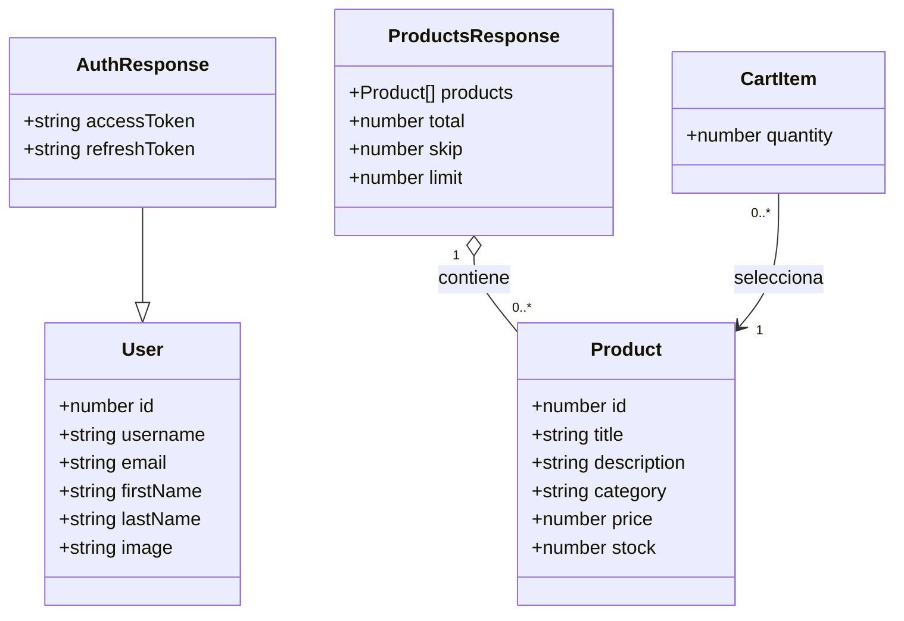

# Modelo de datos de NovaCart

NovaCart utiliza interfaces TypeScript para representar la información de DummyJSON y un carrito local. No existe una base de datos propia: la API suministra usuarios y productos; el navegador conserva la sesión y el carrito.

| Modelo | Campos obligatorios | Campos opcionales | Uso |
| --- | --- | --- | --- |
| `User` | `id: number`, `username: string` | `email`, `firstName`, `lastName`, `image`: `string` | Información del usuario autenticado mostrada en el perfil. |
| `AuthResponse extends User` | Campos de `User`, `accessToken: string`, `refreshToken: string` | Los mismos campos opcionales de `User` | Respuesta de `POST /auth/login`. |
| `Product` | `id: number`, `title`, `description`, `category`: `string`, `price: number` | `discountPercentage`, `rating`, `stock`: `number`; `brand`, `thumbnail`: `string`; `images: string[]` | Producto del catálogo, detalle y carrito. |
| `ProductsResponse` | `products: Product[]`, `total: number`, `skip: number`, `limit: number` | Ninguno | Contenedor del listado devuelto por `GET /products`. |
| `CartItem` | `product: Product`, `quantity: number` | Ninguno | Relaciona un producto con su cantidad seleccionada. |

Las definiciones se encuentran en [src/app/models](../src/app/models). `ProductSource` es el tipo auxiliar `'api' | 'local'`: indica si el catálogo o detalle procede de DummyJSON o del respaldo y permite mostrar el aviso correspondiente.

El diagrama muestra los atributos principales; la tabla identifica cuáles son opcionales. La relación entre `CartItem` y `Product` representa una copia local de los datos del producto, no una reserva de inventario en el servidor.

## Persistencia y reglas

| Clave de `localStorage` | Contenido | Duración |
| --- | --- | --- |
| `novacart.accessToken` | Access token recibido del login. | Hasta cerrar sesión o detectar un token vencido o inválido. |
| `novacart.user` | JSON con los campos permitidos de `User`. | La misma sesión del token. |
| `novacart.cart` | JSON de `CartItem[]`. | Se conserva al recargar y al cerrar sesión; cambia al editar o vaciar el carrito. |

- Se proyecta la respuesta de `/auth/me` mediante `toUser`; campos adicionales como `password` no se guardan. `refreshToken` describe la respuesta real, pero no se persiste ni se utiliza para renovar sesiones.
- El carrito acepta cantidades enteras positivas y limita cada línea al `stock` cuando está disponible. Un producto con stock cero no se agrega. Al restaurar, se descartan registros inválidos, se agrupan duplicados y se ajustan cantidades al stock guardado.
- Los precios se muestran en USD. Los subtotales se calculan como `redondear(price × 100) × quantity`; el total suma centavos y se divide entre 100 al presentarlo. `discountPercentage` es informativo y no se aplica nuevamente al precio.
- El respaldo contiene seis productos reales con imágenes locales. Se utiliza únicamente ante errores de conexión o respuestas 5xx; un identificador inválido o un 404 sigue siendo un producto no encontrado.

El uso de tokens en `localStorage` corresponde a esta demostración académica. La validación local de vencimiento ayuda a gestionar la interfaz; DummyJSON valida la autorización cuando se consulta el perfil.
