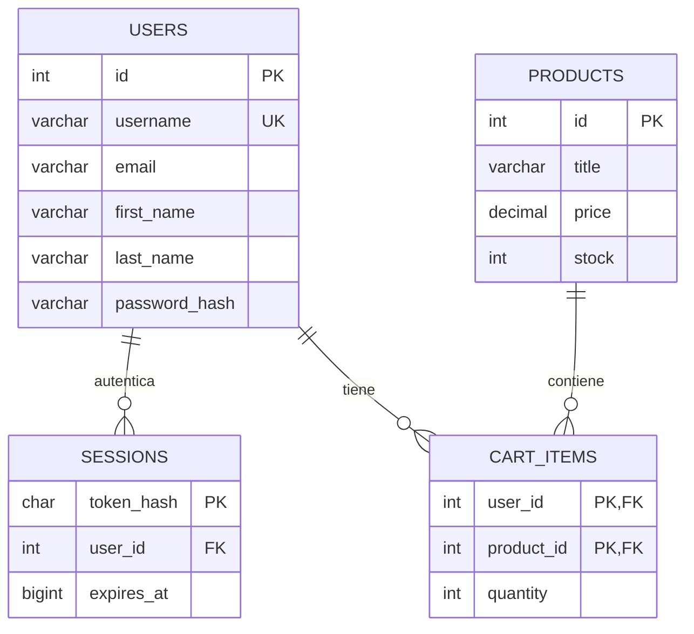

# NovaCart: guía del proyecto simplificado

Versión actual: cuatro pantallas, Angular/Ionic, Axios, PHP, MySQL de XAMPP y MCP local.

Ampliación: [setear, promesas y flujo completo de datos](FLUJO_DATOS_Y_PROMESAS.md). Las APIs están separadas en [server/endpoints](../server/endpoints/), con [ejemplos HTTP por función](api/README.md).

## 1. Qué se implementó

| Pantalla | Archivos en src/app/pages | Qué hace |
|---|---|---|
| Login | login/login.page.ts y .html | Autentica, guarda sesión y abre home |
| Registro | register/register.page.ts y .html | Registra username, nombre, apellido, correo y contraseña |
| Inicio | home/home.page.ts y .html | Consulta, crea, modifica y elimina usuarios |
| Carrito | cart/cart.page.ts y .html | Agrega productos y conserva cantidades por cuenta |

El CRUD principal sigue siendo de usuarios. El carrito es la cuarta pantalla solicitada. Las rutas están en [app-routing.module.ts](../src/app/app-routing.module.ts). La raíz y /index redirigen a login. Home y cart requieren sesión.

## 2. Qué significa “setear”

**Setear significa asignar o establecer un valor.** Es una manera informal de decir “asignar”.

```typescript
this.isSubmitting = true; // Asigna true: hay una solicitud en curso.
this.users = data.users; // Asigna el arreglo recibido de la API.
this.total = cart.total; // Asigna el total del carrito.
```

Asignar una variable solo cambia la memoria de la app. Para conservar un dato se debe escribir en un almacenamiento: en este proyecto, Axios envía la operación a PHP y PHP la guarda en MySQL.

## 3. Qué es una interfaz y cómo se usa

Una interfaz TypeScript describe los campos y tipos que debe tener un objeto. **No crea objetos, no asigna valores y no guarda datos por sí sola.** Sirve para detectar errores de tipos mientras se desarrolla; PHP vuelve a validar los datos que recibe.

La interfaz real del carrito está en [cart-item.model.ts](../src/app/models/cart-item.model.ts):

```typescript
export interface CartItem {
  productId: number;
  title: string;
  price: number;
  quantity: number;
  stock: number;
}

export interface CartResponse {
  items: CartItem[];
  total: number;
}
```

Este ejemplo crea un objeto que cumple la interfaz y luego modifica un campo:

```typescript
const item: CartItem = {
  productId: 1,
  title: 'Mouse inalámbrico',
  price: 249,
  quantity: 1,
  stock: 20
};
item.quantity = 2; // Aquí se “setea” la cantidad.
```

En el componente:

```typescript
items: CartItem[] = []; // Arreglo tipado, inicialmente vacío.

setCart(cart: CartResponse): void {
  this.items = cart.items;
  this.total = cart.total;
}
```

Aquí **setCart es una función que asigna valores**; CartResponse es la interfaz que describe su parámetro.

Otras interfaces del proyecto:

| Interfaz | Función |
|---|---|
| User | Datos públicos del usuario: id, username, nombre, apellido y correo |
| UserInput | Campos que envían registro y formulario de usuarios; contraseña opcional al editar |
| UsersResponse | Respuesta con users: User[] |
| LoginCredentials | username y password enviados al login |
| AuthResponse | Usuario público, accessToken y expiresAt |
| ApiError | Mensaje de error y errores de campos |
| Product | id, title, price y stock del producto |

## 4. Cómo funciona el login

1. [login.page.html](../src/app/pages/login/login.page.html) muestra el formulario.
2. `[(ngModel)]` conecta los inputs con `credentials: LoginCredentials` del archivo [login.page.ts](../src/app/pages/login/login.page.ts).
3. `(ngSubmit)="login()"` llama a `async login(): Promise<void>`. Promise<void> indica que termina de manera asíncrona sin devolver un valor al formulario.
4. Se asigna `isSubmitting = true` y se desactivan los controles para evitar envíos repetidos.
5. Dentro de try, Axios envía usuario y contraseña con await:

```typescript
const { data } = await api.post<AuthResponse>('/auth/login', credentials);
saveSession(data);
const navigated = await this.router.navigateByUrl('/home', { replaceUrl: true });
if (!navigated) throw new Error('No pudimos abrir la página principal.');
```

PHP busca el username mediante una consulta preparada y verifica la contraseña. Si es correcta, genera un token aleatorio y guarda su hash con fecha de vencimiento en la tabla sessions. La contraseña de users se almacena con Argon2id, nunca en texto plano.

`saveSession` guarda token, usuario público y vencimiento en sessionStorage. El servidor comprueba el token en cada operación protegida. `replaceUrl: true` reemplaza la entrada actual del historial al navegar a home.

Si ocurre un error, catch comprueba `axios.isAxiosError<ApiError>(error)`, usa `AxiosError<ApiError>` para leer el mensaje del servidor y activa `failLogin`. El HTML aplica una animación de error. El arreglo `timer` almacena los identificadores de los temporizadores: después de 500 ms se desactiva la animación; al reintentar o destruir el componente se cancelan.

En finally se asigna `isSubmitting = false`, tanto si funcionó como si falló. Las credenciales incorrectas no permiten entrar a home.

**La sesión y los datos son diferentes:** sessionStorage pertenece a la pestaña. Al cerrar normalmente la pestaña y abrir otra se inicia sesión nuevamente. Los usuarios y carritos permanecen en MySQL.

## 5. Cómo funciona el CRUD de usuarios

[HomePage](../src/app/pages/home/home.page.ts) comienza con `users: User[] = []`. `ngOnInit()` llama a `loadUsers(): Promise<void>`; el ciclo de Ionic también actualiza los datos al volver a la pantalla.

```typescript
this.users = await this.usersService.getUsers();
```

El servicio Angular [UsersService](../src/app/services/users.service.ts) usa Axios:

| Operación | Solicitud |
|---|---|
| Consultar listado | GET /api/users |
| Consultar uno | GET /api/users/:id |
| Crear | POST /api/users |
| Modificar | PUT /api/users/:id |
| Eliminar | DELETE /api/users/:id |

El formulario conserva sus datos si una promesa falla. El arreglo cambia solo después de una respuesta exitosa. Una respuesta 401 limpia la sesión y regresa al login.

El username debe ser único, de 3 a 100 letras, números, puntos o guiones. Las contraseñas nuevas requieren entre 8 y 200 caracteres. Al editar, dejar la contraseña vacía conserva la actual; cambiarla revoca las sesiones de esa cuenta. No se puede eliminar la cuenta activa. Esta práctica no implementa roles: cualquier usuario autenticado puede administrar usuarios.

## 6. Cómo funciona el carrito

[CartPage](../src/app/pages/cart/cart.page.ts) comienza con `products: Product[] = []` e `items: CartItem[] = []`. Al entrar, carga productos y carrito con promesas asíncronas. El usuario conectado se determina en el servidor mediante su token.

Al pulsar Agregar o los botones + y -, el componente llama a [CartService](../src/app/services/cart.service.ts):

```typescript
async setQuantity(productId: number, quantity: number): Promise<CartResponse> {
  const { data } = await api.put<CartResponse>(
    `/cart/${productId}`, { quantity }
  );
  return data;
}
```

PHP valida la cantidad y el stock, guarda en cart_items y devuelve el carrito actualizado. Después el componente llama a `setCart(cart)`. Si falla la solicitud, mantiene el carrito mostrado y presenta el error.

| Acción | Endpoint |
|---|---|
| Ver productos | GET /api/products |
| Recuperar carrito | GET /api/cart |
| Asignar cantidad | PUT /api/cart/:productId |
| Quitar artículo | DELETE /api/cart/:productId |

Los precios y el total se calculan a partir de MySQL, no del precio enviado por el navegador. Cada cuenta tiene su propio carrito. No se procesan pedidos ni pagos.

## 7. MySQL y phpMyAdmin

Se utilizó la base **novacart** que ya habías creado. La conexión está en [server/config.php](../server/config.php): host 127.0.0.1, puerto 3306, usuario root y contraseña vacía, según la instalación local comprobada de XAMPP. XAMPP utiliza MariaDB compatible con MySQL.

El archivo [server/schema.sql](../server/schema.sql) crea las cuatro tablas con claves y relaciones. [install.php](../server/install.php) agrega la cuenta demo y tres productos sin borrar datos existentes. La base SQLite anterior dejó de utilizarse.



En phpMyAdmin, abre novacart y selecciona users, products o cart_items para consultar los registros. Los artículos se conservan aunque cierres navegador, Apache o MySQL; al iniciar los servicios otra vez se vuelven a consultar.

Comandos para preparar y ejecutar:

```powershell
npm ci
npm run db:setup
npm run deploy:xampp
```

Abre **http://localhost/novacart/**. Cuenta demo: **emilys / emilyspass**.

Para editar Angular usa `npm run dev` y http://localhost:8100. La API desplegada está en C:/xampp/htdocs/novacart/api. Cambios en PHP requieren `npm run api:deploy`; la actualización completa de Apache usa `npm run deploy:xampp`.

Si cambia la conexión, crea server/config.local.php con los valores correspondientes; ese archivo está excluido de Git. El script de despliegue lo copia a Apache.

## 8. MCP: cómo lo conecté y para qué sirve

**MCP (Model Context Protocol)** permite que Codex use herramientas que consultan tu proyecto. La app usa Axios y PHP para funcionar; MCP es la conexión adicional para que el asistente consulte MySQL.

El recorrido es:

```text
App:    Angular -> Axios HTTP -> Apache/PHP -> MySQL:3306
Codex:  herramienta MCP -> Node stdio -> PHP/PDO -> MySQL:3306
```

Pasos realizados:

1. Instalé `@modelcontextprotocol/sdk` y `zod` como dependencias de desarrollo en package.json.
2. Creé [mcp/server.mjs](../mcp/server.mjs) con el SDK oficial y transporte stdio: Codex inicia un proceso local y se comunica con él por entrada/salida estándar.
3. Registré cuatro herramientas: describe_schema, list_users, list_products y get_cart.
4. Esas herramientas ejecutan [server/inspect.php](../server/inspect.php), que reutiliza la conexión PDO. Solo acepta operaciones fijas de consulta; no admite SQL arbitrario. Los listados están limitados a 100 registros.
5. Guardé la conexión de Codex en [.codex/config.toml](../.codex/config.toml):

```toml
[mcp_servers.novacart_mysql]
command = "node"
args = ["mcp/server.mjs"]
cwd = "C:/Fued3"
enabled = true
```

6. Verifiqué la configuración con `codex mcp get novacart_mysql` y la comunicación real con `npm run test:mcp`.

Para cargar la nueva conexión en Codex, vuelve a abrir el proyecto o inicia una nueva sesión. El servidor queda configurado para este proyecto; si cambias su ubicación, ajusta cwd. MySQL debe estar activo. El MCP no necesita Apache, porque ejecuta PHP por consola.

Puedes pedirle a Codex:

- “Usa novacart_mysql para describir las tablas y relaciones.”
- “Consulta los usuarios con list_users.”
- “Muestra el carrito del usuario con id 1 usando get_cart.”

Las herramientas no devuelven contraseñas ni tokens y no modifican datos. La API de la app sí proporciona las operaciones de escritura solicitadas.

Referencias utilizadas: [MCP en Codex](https://developers.openai.com/codex/mcp), [SDK MCP: servidor y stdio](https://ts.sdk.modelcontextprotocol.io/server), [PDO y consultas preparadas](https://www.php.net/manual/en/pdo.prepare.php), [password_hash](https://www.php.net/manual/en/function.password-hash.php) y [password_verify](https://www.php.net/manual/en/function.password-verify.php).

## 9. Pruebas, evidencia y uso de IA

Los resultados ejecutados se registran en [VERIFICACION_SIMPLE.md](VERIFICACION_SIMPLE.md). Para repetirlos:

```powershell
npm test -- --watch=false
npm run lint
npm run test:api
npm run test:e2e
npm run test:mcp
```

La IA ayudó a interpretar la solicitud, reducir las pantallas, escribir interfaces y servicios, conectar PHP/MySQL, implementar MCP y revisar errores. Las respuestas generadas se contrastaron con compilación, pruebas y ejecución real.

Prompts relevantes, resumidos del encargo:

| Prompt | Resultado |
|---|---|
| “Hazlo mucho más sencillo; 3 o 4 pantallas: register, login, homepage.” | Cuatro pantallas al incluir el carrito solicitado después |
| “Usar interfaces, Axios, isSubmitting, try, await y AxiosError.” | Formularios y servicios tipados con operaciones asíncronas |
| “Setear sessionStorage, reemplazar URL, animación, timer y failLogin.” | Login, sesión, navegación y animación de 500 ms |
| “Sí, solo usuarios.” | CRUD principal de usuarios |
| “En el carrito hacer una interfaz; explicar cómo se setea.” | CartItem, CartResponse, setCart y esta explicación |
| “Base novacart vacía en XAMPP, puerto 3306, phpMyAdmin.” | Tablas MySQL, conexión PDO e instalación en Apache |
| “MCP para MySQL en Codex y explicar cómo.” | Servidor local, herramientas, configuración y prueba del protocolo |

Se interpretó “consultor para rutas” como **constructor con inyección de Router**, y “Promise<vid>” como **Promise<void>**. El arreglo timer almacena identificadores de temporizadores.
