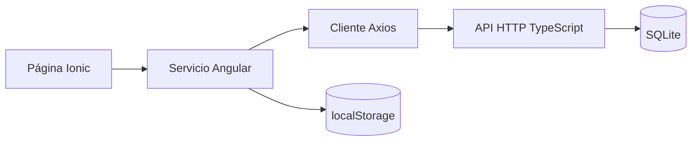

# Servicios Angular para acceso a datos

**Actualización: 21 de septiembre de 2026.** La capa de datos de NovaCart está implementada en [src/app/services](../src/app/services). Las páginas Ionic inyectan servicios Angular y trabajan con las [interfaces TypeScript compartidas](INTERFACES_TYPESCRIPT.md).

## Responsabilidades y persistencia

Los tres servicios declaran `@Injectable({ providedIn: 'root' })`. Angular proporciona una instancia compartida durante la ejecución de la aplicación. Las páginas obtienen esa instancia con `inject(...)`; no necesitan crear servicios con `new` ni abrir conexiones a SQLite.

| Servicio | Datos que administra | Acceso y persistencia |
| --- | --- | --- |
| [ProductsService](../src/app/services/products.service.ts) | `Product`, `ProductInput`, listados y detalles. | Axios llama a `/api/products`; el servidor escribe y consulta SQLite. Catálogo y detalle admiten respaldo local de lectura. |
| [AuthService](../src/app/services/auth.service.ts) | Credenciales de entrada, `User` y token de acceso. | Axios llama a `/api/auth`; el servidor mantiene usuarios y sesiones. El navegador conserva token y perfil en `localStorage`. |
| [CartService](../src/app/services/cart.service.ts) | `CartItem[]`, cantidades e importes. | Mantiene signals y guarda las líneas en `localStorage`, bajo `novacart.cart`. No utiliza endpoints del servidor. |

El [cliente Axios común](../src/app/core/api/axios-client.ts) configura la base `/api`, JSON, un tiempo de espera de 15 segundos y un interceptor que agrega `Authorization: Bearer <token>` cuando hay sesión. [session-storage.ts](../src/app/core/api/session-storage.ts) centraliza la lectura del token, la proyección de datos públicos del usuario y la limpieza de sesión. Son utilidades compartidas de los servicios.



## Operaciones CRUD por servicio

El CRUD persistente solicitado se aplica a productos. El carrito también permite crear, leer, actualizar y borrar líneas locales. Autenticación administra el ciclo de una sesión; la aplicación no ofrece registro ni edición de usuarios.

| Servicio y entidad | Crear | Leer | Actualizar | Eliminar |
| --- | --- | --- | --- | --- |
| `ProductsService`: producto | `createProduct(input)` | `getInventory()`, `getProduct(id)`; `getProducts()` para catálogo. | `updateProduct(id, input)` | `deleteProduct(id)` |
| `CartService`: línea local | `addProduct(product)` | `items()`, `getItems()` | `increaseQuantity(id)`, `decreaseQuantity(id)` | `removeProduct(id)`, `clearCart()` |
| `AuthService`: sesión | `login(credentials)` | `getCurrentUser()`, `user()`, `getToken()`, `isAuthenticated()` | No existe renovación o edición de sesión. | `logout()` revoca la sesión y limpia el navegador. |

### Productos

| Firma pública | Operación HTTP | Resultado y comportamiento |
| --- | --- | --- |
| `getInventory(): Promise<Product[]>` | `GET /products?limit=0` | Devuelve todos los productos de la API. Extrae `products` de `ProductsResponse`. Un error se propaga a la página. |
| `getProducts(): Promise<ProductListResult>` | Usa `getInventory()` | Devuelve `{ products, source }` para el catálogo. `source` vale `'api'` o `'local'`. |
| `getProduct(id: string \| number): Promise<ProductDetailResult>` | `GET /products/:id` | Devuelve `{ product, source }`. Un identificador inválido o respuesta `404` produce `ProductNotFoundError`. |
| `createProduct(input: ProductInput): Promise<Product>` | `POST /products` | Envía los campos editables y recibe el producto con `id` asignado por SQLite. |
| `updateProduct(id: number, input: ProductInput): Promise<Product>` | `PUT /products/:id` | Requiere identificador entero positivo y todos los campos obligatorios de `ProductInput`; recibe el producto actualizado. |
| `deleteProduct(id: number): Promise<void>` | `DELETE /products/:id` | Requiere identificador entero positivo; termina después de que la API confirme la eliminación. |

Las rutas de la tabla son relativas a `/api`. `PUT` recibe la entrada completa: omitir los campos opcionales `brand` o `thumbnail` los deja vacíos. El servicio no crea ni elimina productos locales para aparentar una escritura correcta cuando falla la API.

El respaldo del catálogo y detalle sólo se usa ante errores de red o tiempo de espera reconocidos por Axios y respuestas HTTP 5xx. No se activa por cancelaciones ni errores 4xx. Los datos incluyen `source` para mostrar su procedencia en la pantalla. `getInventory()` siempre exige una respuesta de la API.

### Autenticación

`login(credentials: LoginCredentials): Promise<void>` construye `LoginRequest` con 60 minutos de vigencia, recibe `AuthResponse`, separa `accessToken` y guarda sólo los campos permitidos de `User`. Expone el perfil con el signal de sólo lectura `user`.

`getCurrentUser(): Promise<User>` consulta `/auth/me`, valida el objeto y actualiza perfil y almacenamiento. `isAuthenticated(): boolean` comprueba que existan usuario y token local vigente; el servidor vuelve a validar firma y sesión en cada petición protegida. `getToken(): string | null` permite consultar el token almacenado.

`logout(): Promise<void>` solicita la revocación en `/auth/logout`, limpia los datos locales y navega a `/login`. Si falla la conexión al cerrar sesión, la limpieza local se realiza igualmente y la sesión remota permanece hasta su vencimiento. El carrito se conserva.

### Carrito

`addProduct(product: Product): boolean` crea una línea con cantidad uno o incrementa la existente; devuelve `false` si el producto es inválido o no admite más unidades. `increaseQuantity(productId: number): boolean` respeta las existencias de la copia guardada. `decreaseQuantity(productId: number): void` reduce hasta una unidad; para borrar se usa `removeProduct(productId: number): void`. `clearCart(): void` vacía todas las líneas.

`getItems(): CartItem[]` obtiene las líneas y `items()` permite leer el signal en la plantilla. `totalItems()`, `getTotalItems()`, `getTotal()` y `getSubtotal(item)` facilitan mostrar unidades e importes. Los importes se calculan en centavos antes de expresarlos en USD.

Al restaurar el carrito se descartan datos inválidos, se agrupan identificadores duplicados y se ajustan cantidades al stock almacenado. Si `localStorage` está bloqueado, el carrito conserva los cambios en memoria y expone `persistenceError()`. La pantalla muestra el aviso y permite llamar a `retryPersistence(): void` para guardar el estado actual; un guardado correcto elimina el aviso. El stock y precio son copias locales; la compra simulada no crea pedidos ni descuenta inventario del servidor.

## Inyección y uso real desde una página Ionic

Estos fragmentos proceden de [inventory.page.ts](../src/app/pages/inventory/inventory.page.ts). Dentro de `InventoryPage`, la dependencia y el listado se declaran así:

```typescript
private readonly productsService = inject(ProductsService);
readonly products = signal<Product[]>([]);
```

La página importa `inject` y `signal` desde `@angular/core`, `Product` desde `../../models/product.model` y `ProductsService` desde `../../services/products.service`. En `loadInventory()` consulta y actualiza el signal después de recibir los datos:

```typescript
this.products.set(await this.productsService.getInventory());
```

En `saveProduct()`, el formulario ya normalizado y validado produce `input: ProductInput`. La página elige crear o actualizar según `editingId`:

```typescript
const saved: Product = id === null
  ? await this.productsService.createProduct(input)
  : await this.productsService.updateProduct(id, input);
```

Al eliminar, el diálogo Ionic pide confirmar y la página espera al servidor antes de quitar el producto del listado:

```typescript
await this.productsService.deleteProduct(product.id);
this.products.update(products => products.filter(item => item.id !== product.id));
```

Estos son extractos, no un componente adicional. El archivo fuente incluye el decorador `@Component`, el formulario, las fases `PagePhase`, validaciones y bloques `try/catch` completos. Ante un error de guardado, conserva los datos del formulario para reintentar; los mensajes por campo siguen el contrato `ApiError`. Una respuesta `401` deriva al cierre de sesión.

## Verificación y límites de la entrega

Las pruebas de servicio están en [products.service.spec.ts](../src/app/services/products.service.spec.ts), [auth.service.spec.ts](../src/app/services/auth.service.spec.ts) y [cart.service.spec.ts](../src/app/services/cart.service.spec.ts). Las pruebas del servidor están en [server/tests](../server/tests). [VERIFICACION.md](VERIFICACION.md) registra los comandos que se ejecutaron y sus resultados; este documento describe el código y no sustituye ese registro.

El [README](../README.md#probar-el-crud-desde-la-pantalla) contiene el recorrido manual del inventario y [API.md](API.md) detalla validaciones, códigos HTTP y persistencia. El [modelo de datos](MODELO_DATOS.md) incluye diagramas de entidades y servicios.
